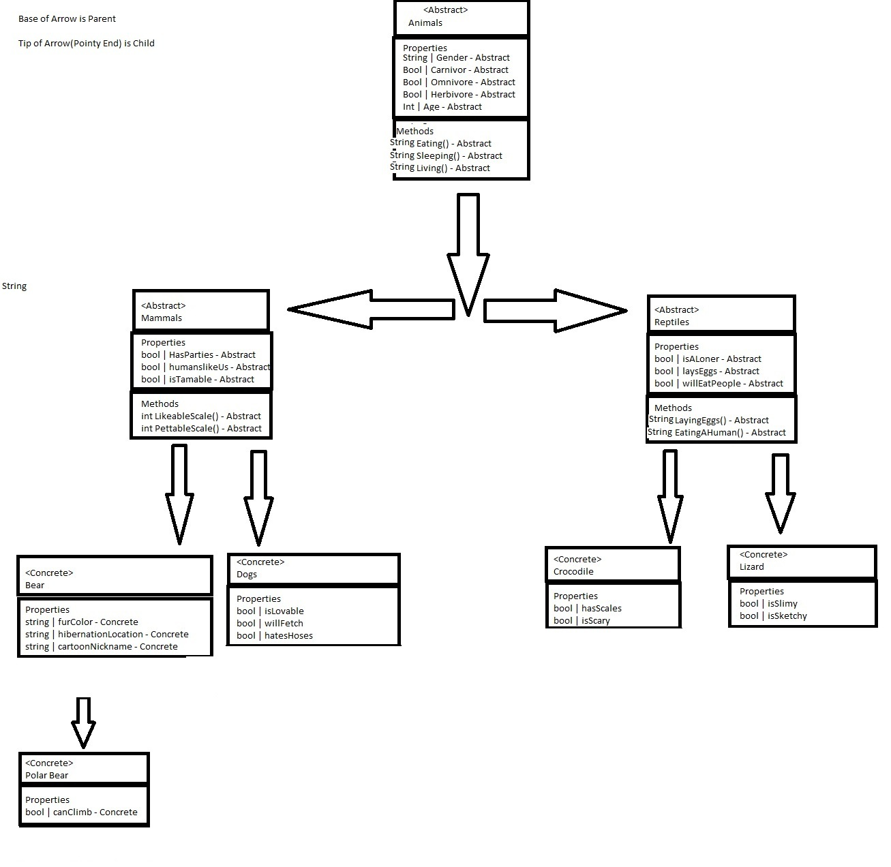

# Lab06 OOP Principles 1/2

*Author(s): Bryant Davis, Peyton Cysewski*

----

## Description
This application is a simple demostration of the implementation of two Object Oriented Programming Principles: Inheritance and Abstraction. The methods only output simple strings to the console, but they represent a program that was created using three layers of inheritance with certain parts being strictly abstract.

---

### Principles

#### Inheritance
The meta property of inheritance allows all of the behaviors of a parent class to be passed down and be used in a child class. In our example the base class of the whole inheritance hierarchy has a sleeping method. Any subsequent class in this program would have an instance of the sleeping method in it. It is passed down through each generation from parent to child.

#### Abstract
Any class that has an ```abstract``` keyword means that it cannot be instantiated as an object. The best way to think about this is that it is quite literally an abstract definition of what something is. For example, in our program there is a lizard class that is derived from a reptile class. The reptile is abstract and has all of the specific properties of a reptile without being one itself. It holds the 'reptileness' of what it means to be a lizard. Its child class of lizard adds the details necessary to make it a lizard.

---

### UML Diagram


---

### Getting Started
Clone this repository to your local machine.

```
$ git clone https://github.com/Peyton-Cysewski/Lab06-OOP-Principles-1.git
```

### To run the program from Visual Studio:
Select ```File``` -> ```Open``` -> ```Project/Solution```

Next navigate to the location you cloned the Repository.

Double click on the ```Lab06-OOP-Principles-1``` directory.

Then select and open ```Lab06-OOP-Principles-1.sln```

---

### Visuals


#### Using the Application


---

### Change Log
1.1: *Initial release* - 13 July 2020  


------------------------------